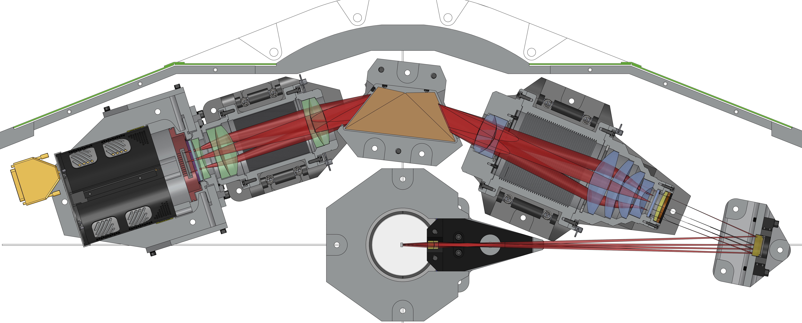

Introduction
============

It is widely accepted that time domain astronomy, particularly the sub-fields of transient, variable star, and asteroid astronomy, is undergoing exponential growth. Indeed, the selection of the Large Synoptic Survey Telescope (LSST) by Astro-2010 explicitly recognizes that time domain astronomy will enjoy a golden phase during this decade. The resurgence and revitalization of this field is due to technological advances in sensors as well as computing.

We argue that the present approach of using "low" resolution spectrographs (:math:`R=\lambda/\Delta\lambda\sim 1,000`) is over-kill. Furthermore, the traditional slit-spectrograph inevitably requires many minutes for object acquisition, leading to a less than perfect "on source" efficiency. Here, we present the design for a very low resolution (:math:`R\sim 100`) Integral Field Unit (IFU) spectrograph (hereafter SED Machine or Spectral Energy Distribution Machine; Figure :ref:`fig-model` which is sufficient for the classification of transient candidates, and when mounted on a 1-m to 3-m class telescope, will perform this task more efficiently than current instruments on larger aperture telescopes. The greater availability of observing time on small aperture telescopes further means that more candidates can be classified, and the classification can occur closer to the discovery epoch.

.. _fig-model:

    SED Machine spectrograph instrument layout.
    Test of caption

History
-------
The SED Machine project began in December 2009 at the Palomar Observatory holiday party. There Shri Kulkarni, Robert Quimby, and Nick Konidaris sketched out the idea for a very low cost (~$20 K in parts) classification spectrograph. Since the holiday party, the SED Machine has evolved from a super-low-cost spectrograph made with Nikon lenses, to a full professional development effort. We thank the NSF ATI program for providing us with grant \#1106171.

Scientific Goals
----------------

Instrument Architecture: Imager + Spectrograph
----------------------------------------------

