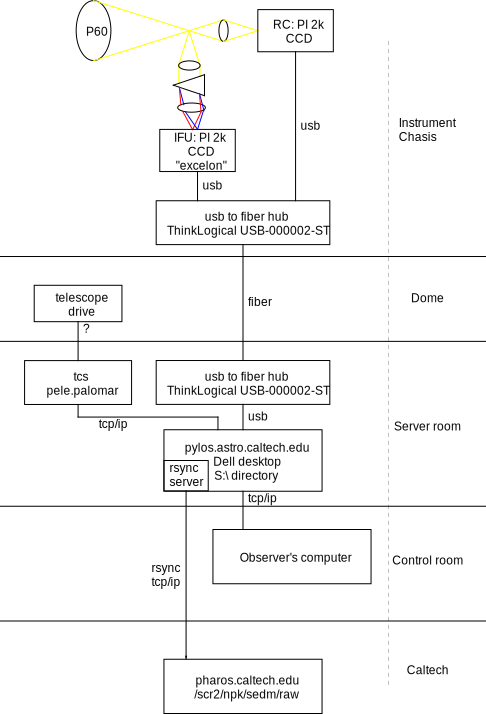
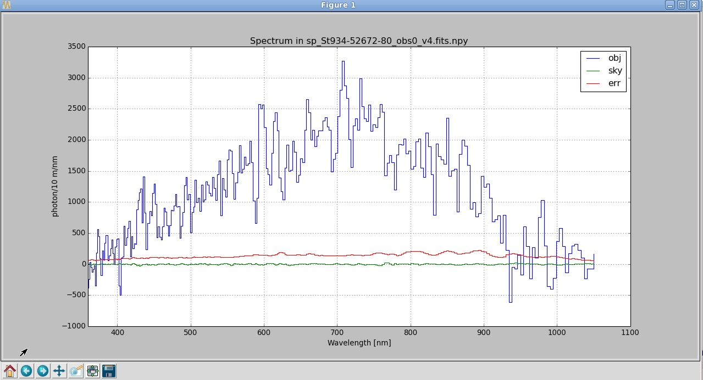

Operating SEDM + Pipeline as of June 2015
=========================================

This documentation is primarily for developers of the pipeline. As of June 2015, and for the near-term future, SED Machine is not yet a robotic facility. This means that users participate in "traditional" observing with the instrument. As the instrument evolves, this section will become obsolete.

Introduction & Overview
-----------------------

SED Machine was designed to be a simple-to-use instrument.

The prepared observer will come to the telescope with a:

    * A formatted target list (see ":ref:`ss-targetlist`").
    * Finding charts for said targets.

Before dinner, the astronomer should:
    * Make sure the water pump is running and not leaking (see ":ref:`ss-pump`").
    * Startup SEDM software (see ":ref:`ss-startup`").
    * Put the telescope in the flat-stow position via the SEDM GUI.
    * Focus the spectrograph using dome lamps.
    * Arc spectra (Hg, Xe, Cd; see ":ref:`ss-arcspectra`")
    * Flat spectra (Twilight, dome, xenon; see ":ref:`ss-flatspectra`")
    * Begin rsync process to transfer calibration data to Caltech (see ":ref:`ss-dataflow`").
    * ssh into pharos.caltech.edu and run the pipeline on the calibration data (this step takes half an hour or more, and thus should be performed before sunset).

At sunset, the observer will:
    * Focus the telescope on the spectrograph and confirm that the imager and spectrograph are parfocal.
    * Point the telescope at a bright star to zero the pointing model (TX).
    * Observe at least one standard-star (more preferred) (current list includes 25 objects): https://github.com/nickkonidaris/kpy/tree/master/NPK/standard_stars
    * ssh into pharos.caltech.edu and run the pipeline on standard stars (takes a few minutes).

With a calibrated instrument, the observer can begin his or her science program and expect flux-calibrated spectra a few minutes after an observation set is complete:
    * Objects fainter than about 17th mag should be taken with at (at least) two positions for A-B sky subtraction.
    * Objects brighter than 17th mag can have a single "A" position exposure (they're much brighter than sky).
    * ssh into pharos.caltech.edu and run the pipeline on science data. Note that for A-B data, one has to wait for both frames to finish.

.. _ss-pump:

Starting the water pump
^^^^^^^^^^^^^^^^^^^^^^^
The water pump is a copper [#f1]_ Koolance cooler. The cooler lives on the dome floor and is plugged into the instrument directly. Connection of water pump is as follows:

1. Connect first plumbing line from Koolance to instrument panel.
2. Connect second plumbing line from Koolance to instrument panel.
3. Connect power to Koolance.
4. Turn Koolance on, you should hear the Koolance start whirling as water circulated.
    * Use a flashlight to make sure that water is circulating.
5. Make sure that the Koolance light is off, but that the Koolance itself is running.

Note: Once a week check that there are no leaks in the instrument by opening the instrument chasis and inspecting for signs of leaks.

.. [#f1] The cooler and detectors are internally lined with copper plumbing. It's possible to buy an Aluminium Koolance cooler which will cause an electrolytic process to occur that gunks up the internals of our expensive detector system. Please only use copper Koolance systems.

.. _ss-startup:

Software Startup
^^^^^^^^^^^^^^^^

The SEDM control software operates via Python. The Enthought Canopy suite is used to run the SEDM control software. To startup the software, double-click on the "startup SEDM button" on the desktop.

Arrange the windows as shown in the figure below:

.. todo:: desktop image of windows.

.. _ss-targetlist:

Target List
^^^^^^^^^^^
The target list is stored on pylos at the (default) "s:/targets.txt" file. The path is modified in Options.py.

The targets.txt file is space-delimited and formatted as follows::

    name HH MM SS Deg min sec epoch # Comment as much as you like
    HORIZON-name # !@~ Comment follows

Note that the name field goes into the fits header and is an integral part of the data reduction pipeline function.

An example would be::

    BD+28d 21 51 11.07 +28 51 51.8 2000 # BD+28 standard Star V~10.5
    HORIZON-9950 # !@~ 9950 ESA (1990 VB) in Geocentric orbit.

HORIZON-name indicates to the TCS that it should look for the ephemeris from the JPL Horizon server for the object named name. Valid names can be found at the horizon server here: http://ssd.jpl.nasa.gov/horizons.cgi.

In any case, the file is parsed by parse.py found https://github.com/nickkonidaris/SEDC/blob/master/parse.py.

.. _ss-arcspectra:

Arc spectra
^^^^^^^^^^^

Arc spectra are generated by placing an arclamp at the front-end of the telescope. There are no internal arclamps. The observer is responsible for putting the lamps in place by hand.

.. todo:: Explain how one installs arclamps on front end.

If you use the SEDM default GUI code, it will wait for several minutes, then take a test exposure, estimate the lamp brightness, and expose for the appropriate amount of time to achieve the 75% full well.

For aficionados, the full-well of the detector is about 45,000 electron. Note that the gain defaults to "medium" or about 1.8 e- per ADU, in this case expect the strongest line to be about 25,000 ADU. (Certificates of performance can be found in the section ":ref:`detector-performance`".)

The Ne and Hg lamp spectra require at least five minutes to warm up; if not, weak infrared (presumably OH) will appear in the spectra and contaminate the spectrum. The Cd and He lines require ten minutes to warm up.

The code in `Wavelength.py <https://github.com/nickkonidaris/kpy/blob/master/SEDMr/Wavelength.py>`_ is responsible for converting the 2k x 2k FITS files into a wavelength solution for each position. The data reduction code Wavelength.py performs a multi-pass process that makes a rough wavelength solution, and then subsequently refines the wavelength solution to deliver a fraction-of-a-pixel wavelength solution.

.. todo:: Experiment on the telescope + demonstrate that the arclamp position only has a minor impact on wavelength solution.

.. _ss-flatspectra:

Flat spectra
^^^^^^^^^^^^

Flat spectra are generated by either illuminating the dome or by taking "twilight" flats.

Dome flats for the IFU + RC:

#. A small quartz lamp in the secondary of P60. Quartz provides a near blackbody spectrum.
#. A broad Xenon lamp is placed in the dome by the observer and pointed at the
#. LED lamps used to calibrate the RC.

Twilight flats for the IFU + RC:

#. Twilight flats provide necessary blue light for flat-field correction.

.. _ss-dataflow:

The Flow of Data
^^^^^^^^^^^^^^^^

SED Machine data come from three sources:

* P60 telescope control system (TCS). This is accessed via telnet to pele.palomar.caltech.edu.
* Rainbow camera detector: This is accessed via a fiber-to-usb bridge (ThinkLogical USB-000002-ST see :ref:`fiber-repeater`) from the server room to the instrument itself. The detector is an e2v 2048 x 2048 x 13.5 µm pixel device.
* IFU camera detector: This is accessed via a fiber-to-usb bridge (ThinkLogical USB-000002-ST) from the server room to the instrument itself. The detector is an e2v 2048 x 2048 x 13.5 µm pixel device.

The data from these above three sources are packaged into a variety of log files and FITS files and stored in the S:\ drive on the computer named "pylos". The data from pylos are transferred via rsync to pharos.caltech.edu:/scr2/npk/sedm/raw.

The data flow as shown in Figure ":ref:`fig-dataflow`".

.. _fig-dataflow:

    SED Machine data sources and data flow schematic.

.. todo:: show example target lists and target selection gui.

.. todo:: document guider code.

Data Storage
^^^^^^^^^^^^

Data from the TCS, RC camera, and IFU camera are collected together and packaged into FITS files (except for guider, see Note below). The FITS files thus contain a wealth of information about the source, observing conditions, and instrument. The FITS header should be documented here.

.. todo:: document fits headers here.

Note that as of late June 2015, the guider offset commands are not yet collected into the FITS headers. Offset commands should be included soon.

Data storage example
^^^^^^^^^^^^^^^^^^^^

In the absence of a log file, one can use the "spy what" command to examine the contents of data. For instance, to look at data taken near sunset, one would execute the following commands on pharos::

    pharos% pwd
    /scr2/npk/sedm/raw/2015mar25
    pharos% ~npk/spy what ifu*2[01]_??_??.fits
        ifu20150325_20_00_03.fits (2.609/2.0/120.0 s): STD-Feige66 [B]
        ifu20150325_20_05_32.fits (2.981/0.1/180.0 s): STD-HZ44 [A]
        ifu20150325_20_09_21.fits (2.885/0.1/180.0 s): STD-HZ44 [B]
        ifu20150325_20_13_27.fits (1.025/2.0/10.0 s): focus sao
        ifu20150325_20_14_02.fits (1.024/2.0/10.0 s): focus sao - Focus: 14.0
        File may have been truncated: actual file length (6012928) is smaller than the expected size (8398080)
        ifu20150325_20_14_17.fits (1.024/2.0/10.0 s): focus sao - Focus: 14.1
        ifu20150325_20_14_32.fits (1.024/2.0/10.0 s): focus sao - Focus: 14.2
        ifu20150325_20_14_46.fits (1.024/2.0/10.0 s): focus sao - Focus: 14.3
        ifu20150325_20_38_23.fits (1.032/0.1/1200.0 s): St934-52672-80 [A]
        ifu20150325_20_59_07.fits (1.016/0.1/1200.0 s): St934-52672-80 [B]
        ifu20150325_21_13_01.fits (1.001/2.0/1.0 s):
        ifu20150325_21_14_47.fits (1.001/2.0/10.0 s):
        ifu20150325_21_35_51.fits (1.000/0.1/1200.0 s): St1210-52701-236 [A]
        ifu20150325_21_56_34.fits (1.001/0.1/1200.0 s): Not defined [B]

Running the Pipeline
--------------------

The pipeline lives on pharos.caltech.edu, its repository can be found at https://github.com/nickkonidaris/kpy (the SEDMr repository).

I _strongly_ recommend that you connect to pharos via VNC. If your connection closes, this allows you to preserve state and long-running commands are not shutdown.

One can execute a "SED Machine verison of Python" as follows ::

    pharos> ~npk/sedm

The following steps must be followed:

1. Create a directory to put output data::

    pharos> mkdir /scr2/npk/cd /scr2/npk/sedm/OUTPUT/

2. Copy data from the RAW directory to the output directory. This is a bit confusing because files are labeled with local time, so they're split into two directories. Thus you must use the Mover command::

    # Do this to reduce date on Mar 25 2015
    pharos> cd /scr2/npk/sedm/OUTPUT/
    pharos> ~npk/spy move /scr2/npk/sedm/raw/2015mar25/ifu*fits .
    pharos> ~npk/spy move /scr2/npk/sedm/raw/2015mar26/ifu*fits .
        OUTPUT ....
    pharos> ls
    2015mar24 2015mar25 2015mar26

#. Create the Makefile::

    pharos> cd 2015mar25
    pharos> ~npk/spy /scr2/npk/PYTHON/SEDMr/Plan.py ifu*fits
    OUTPUT should indicate several types of calibrations (Hg, Cd, twilight, dome, Xe)

#. Check the makefile (with less) to see that its populated. NOTE: The Makefile dependencies are not yet correct, this will take a few days of debugging to get right. For now, you have to handle the makefile "By hand".

#. Execute the following ::

    # Create bias and debias the FITS files in the directory. Output should move
    # fast here.
    pharos> make -j16 bias
    # Now check bias files created
    pharos> ls b_*
    # lots of output should be here

    # Now cosmic ray reject:
    pharos> make -j4 crrs
    # Cosmic ray reject is buggy. Keep using the unix top command to see
    # if any process has been running for more than 20 minutes. If it has,#
    # you must kill the offending process

    # Now create the wavelength solution. The first two steps are a few minute.
    pharos> make -j16 seg_dome.fits
    pharos> make -j16 seg_Hg.fits
    pharos> make -j16 Xe.fits

    # These steps do the heavy lifting and take many minutes.
    # Perform these steps in the afternoon during dinner.
    pharos> make -j16 rough.npy
    pharos> make -j16 fine.npy
    pharos> make -j16 cube.npy

    # Remove scattered "background " light, this is a very memory-intensive
    # process. Make sure to not use too many cores (or you'll kill pharos).
    # Each file will take about five minutes, it's worth doing this constantly
    # throughout the night.
    # Make sure to perform this step during dinner.
    pharos> make -j2 back

    # Make flexure measurements, should take ~ 30s
    pharos> make -j8 flex

#. It's worth performing the following checks. HINT: During the course of the night, make sure you rune the Check.py routine to ensure the spectrograph is in focus.

    1. Check that the dome.fits file and dome_seg.fits file correspond by opening both in ds9. For instance, the following image shows good agreement:

    .. figure:: dome.jpg

    2. Check that the identified ridgelines map to the dome lamps by executing "ds9 dome.fits -region ds9_dome.fits_segments.reg". The output should look like:

    .. figure:: dome_traces.jpg

    3. Check that the data cube looks regular and that RMS trace width is about 1.1 or 1.2 pixel. If much higher the spectrograph is out of focus. Execute ::

        pharos> ~npk/spy check --cube cube.npy

    .. figure:: cube_check.jpg

    The above image shows a few "blank spots" at the edge of the field, these are probably OK. The streak of missing spaxels in the upper left is a problem and a bug in the DRP code. As long as the streak doesn't go through the "middle" of the IFU, you should proceed.

    4. Look at some of the flexure measurement PDF files. In some cases (Calibration data or short exposures) the flexure measurement will be garbage; the DPR should recognize these types of exposures and ignore them (bug: it doesn't yet.) Ignore these short exposures, instead take a look at a long science exposure, example::

        pharos> acroread flex_bs_crr_b_ifu20150326_03_49_39.npy.pdf

    you will see a figure like:

    .. figure:: flexure_check.jpg

    The green line found the strong sodium emission feature in the night sky, and the flexure measurement is based on the offset between this green line and its expected position.

#. Reduce your first spectrum, for instance, a standard star::

    # Search Makefile for the target spectrum name
    pharos> less Makefile
    pharos> make STD-BD+33d2642_obs3.npy

#. Check the spectrum::

    ~npk/spy check --spec spectrum_STD-BD+33d2642_obs3.npy

You'll see:

#. Document A-B extractions here.
